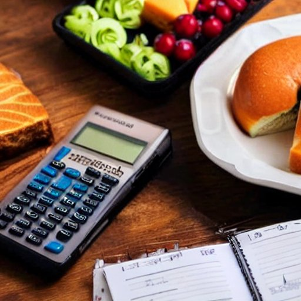
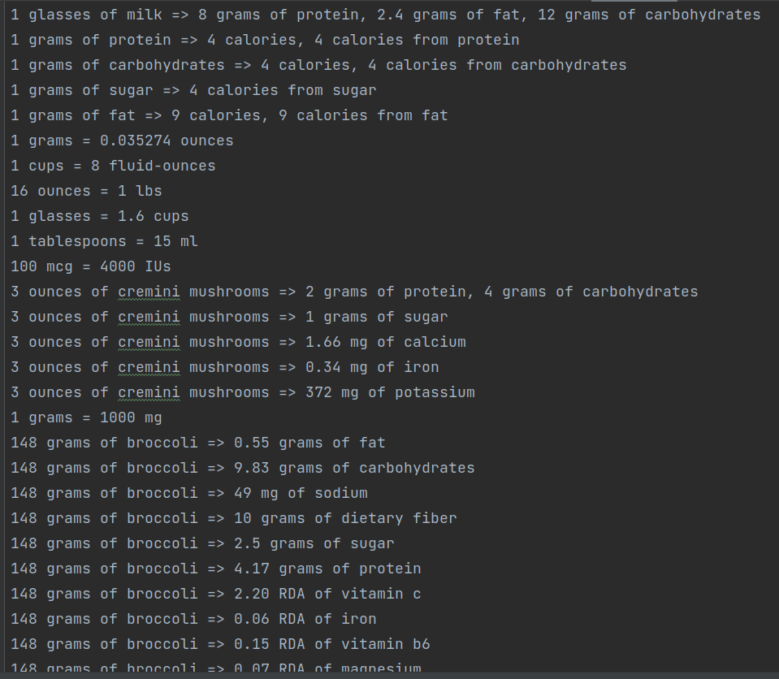
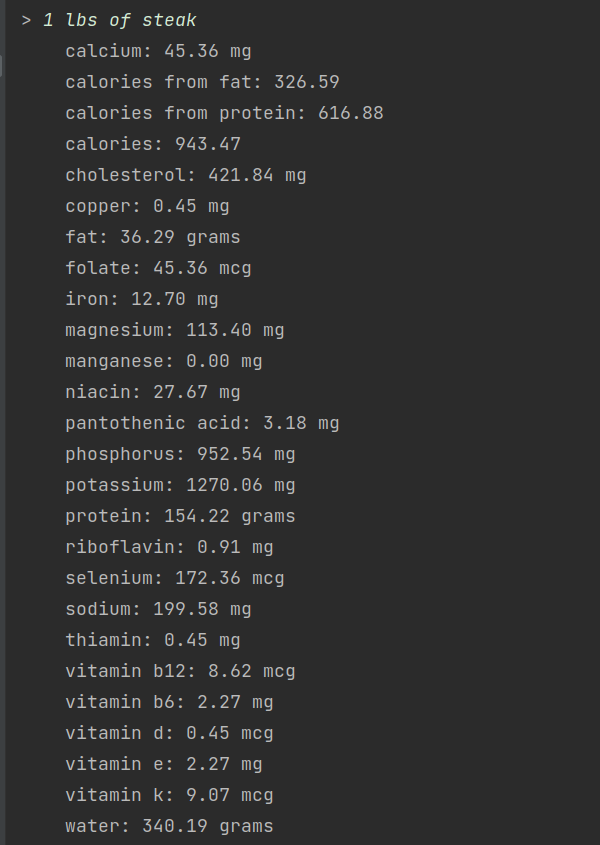

# QuantiFood

### What is QuantiFood?

QuantiFood is an early-stage, work in progress app I am working on 
to help people track their food intake and make better food choices.
It is currently very difficult to be able to tabulate and include 
even a fraction of the micronutrients in your diet. QuantiFood aims to
make this easier by providing a database of foods and their micronutrients, 
along with clever ways of converting between arbitrary units of measurement.

### How does it work?

QuantiFood is currently a command line app (although see the roadmap below).
Here is an example of the format of the rules it is able to parse:

From those rules, it is able deduce answers to queries such as:

### Roadmap

* [x] Create a text format, and a parser for defining foods and their micronutrients, 
as well as the conversion factors between different units of measurement.
* [ ] Add some scripts to scrape the USDA database.
* [ ] Allow for import/export with spreadsheets (.csv, .xlsx, etc.)
* [ ] Create a GUI for the app.
* [ ] Be able to track food intake over time.
* [ ] Specify daily/weekly/monthly goals for intake.
* [ ] Numerically handle uncertainty in the data.

